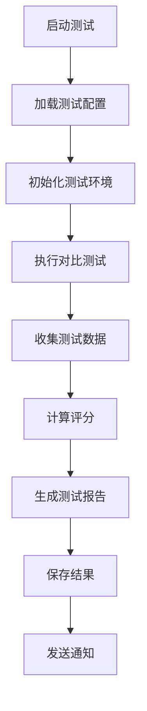

# 测试验证框架与SmartUI的关系详解

## 📋 概述

本文档详细说明了测试验证框架与SmartUI智能界面系统的关系，解释了测试框架的设计目的、实现方式以及如何确保SmartUI系统的质量和性能。

## 🎯 测试框架的设计目标

### 主要目标
1. **验证集成效果** - 证明SmartUI集成Claude Code SDK后的能力提升
2. **确保系统质量** - 通过全面测试保证系统稳定性和可靠性
3. **性能基准测试** - 建立性能基准，监控系统性能变化
4. **功能完整性验证** - 确保所有宣传的功能都能正常工作
5. **用户体验保证** - 通过真实场景测试确保良好的用户体验

### 次要目标
- 提供持续集成的质量门禁
- 为系统优化提供数据支持
- 建立回归测试机制
- 创建性能监控体系

## 🏗️ 测试框架架构

### 核心组件关系图

```
SmartUI 智能界面系统
├── 前端应用 (React + Vite)
│   ├── GitHub文件浏览器
│   ├── 智能代码编辑器
│   ├── 聊天界面
│   └── MCP服务连接
│
├── 后端服务 (Python + FastAPI)
│   ├── Claude Code SDK集成
│   ├── 增强版SmartInvention MCP
│   ├── 路由系统
│   └── 缓存系统
│
└── 测试验证框架 ⭐
    ├── 对比引擎测试
    ├── 真实世界场景测试
    ├── 路由器测试
    ├── 性能基准测试
    └── 集成测试
```

## 📊 测试框架详细分析

### 1. 对比引擎测试 (`comparison_engine_test.py`)

#### 功能描述
对比引擎是测试框架的核心组件，专门用于量化比较SmartUI集成系统与原始Manus系统的能力差异。

#### 与SmartUI的关系
- **直接测试目标**: SmartUI的Claude Code SDK集成效果
- **测试方式**: 并行调用两个系统，对比响应质量
- **评估维度**: 
  - 响应质量评分 (0-10分)
  - 性能评分 (基于响应时间)
  - 功能完整性评分
  - Claude Code特有功能检测

#### 核心测试方法

```python
class ComparisonEngine:
    def calculate_response_quality_score(self, response: Dict[str, Any]) -> float:
        """计算回应质量评分 (0-10)"""
        score = 0.0
        
        # 基础分数
        if 'error' not in response:
            score += 2.0
        
        # 内容丰富度
        if isinstance(response.get('analysis'), dict):
            score += 2.0
        if isinstance(response.get('recommendations'), list):
            score += 2.0
        if isinstance(response.get('tools_used'), list):
            score += 1.0
            
        # Claude Code 特定功能 (SmartUI独有)
        if 'claude_code_analysis' in response:
            score += 1.5
        if response.get('system_type') == 'fully_integrated_intelligent_system_asgi':
            score += 0.5
            
        return min(score, 10.0)
```

#### 测试流程
1. **准备测试用例** - 使用真实的开发需求作为输入
2. **并行测试** - 同时调用SmartUI系统和模拟的Manus系统
3. **结果对比** - 从多个维度对比两个系统的响应
4. **评分计算** - 使用标准化的评分算法
5. **结果记录** - 保存详细的测试结果和分析

### 2. 真实世界对比测试 (`real_world_comparison_test.py`)

#### 功能描述
使用真实的软件开发场景来测试SmartUI在实际工作流中的表现，确保系统在真实环境中的可用性。

#### 测试场景设计

```python
self.real_requirements = [
    {
        "id": "REQ-001",
        "title": "电商平台开发",
        "requirement": "需要开发一个电商平台，包含用户注册登录、商品展示、购物车、订单管理、支付集成、库存管理、评价系统等功能。技术栈希望使用 React + Node.js + MongoDB。",
        "context": {"user_role": "developer", "project_type": "web_application", "complexity": "high"}
    },
    {
        "id": "REQ-002", 
        "title": "API 性能优化",
        "requirement": "我们的 REST API 响应时间过长，平均 2-3 秒，需要优化到 500ms 以内。主要问题可能在数据库查询、缓存策略、代码逻辑等方面。请提供具体的优化方案。",
        "context": {"user_role": "developer", "project_type": "performance_optimization", "complexity": "medium"}
    }
    // ... 更多真实场景
]
```

#### 与SmartUI功能的对应关系

| 测试场景 | SmartUI功能 | 验证重点 |
|---------|------------|----------|
| 电商平台开发 | GitHub文件浏览器 + 代码编辑器 | 项目结构分析、代码生成建议 |
| API性能优化 | Claude Code分析 | 性能瓶颈识别、优化方案生成 |
| 微服务架构设计 | 智能聊天助手 | 架构设计建议、最佳实践推荐 |
| React组件开发 | 代码编辑器 + 智能提示 | 组件设计、代码质量检查 |
| 数据库设计优化 | Claude Code分析 | 数据库结构分析、索引优化建议 |

### 3. 路由器测试 (`run_claude_router_tests.py`)

#### 功能描述
专门测试SmartUI后端的Claude Code路由系统，确保智能路由、负载均衡和故障转移功能正常工作。

#### 测试内容
- **智能路由决策** - 验证请求能够被正确路由到最适合的处理器
- **负载均衡** - 测试系统在高并发情况下的表现
- **故障转移** - 验证当某个组件失效时的自动切换机制
- **上下文管理** - 测试200K tokens上下文的处理能力

#### 与SmartUI的关系
路由器是SmartUI后端的核心组件，直接影响用户体验：
- **响应速度** - 智能路由确保请求被快速处理
- **系统稳定性** - 故障转移保证服务不中断
- **功能完整性** - 正确的路由确保所有功能都能被访问

### 4. 测试配置文件 (`claude_code_vs_manus_test_template.yaml`)

#### 功能描述
定义了完整的测试配置，包括系统参数、测试用例和评估标准。

#### 关键配置项

```yaml
configuration:
  # SmartUI + Claude Code 系统配置
  aicore_system:
    server_url: "http://127.0.0.1:8080"
    context_capacity: 200000  # 200K tokens (SmartUI优势)
    enhanced_features: true
    
  # 原始 Manus 系统配置 (对比基准)
  manus_system:
    context_capacity: 32000   # 32K tokens
    enhanced_features: false
    
  test_config:
    comparison_metrics:
      - "response_quality"      # 响应质量
      - "context_understanding" # 上下文理解
      - "code_analysis_depth"   # 代码分析深度
      - "technical_accuracy"    # 技术准确性
      - "response_completeness" # 响应完整性
```

## 📈 测试结果分析

### 实际测试数据

根据 `comparison_test_results.json` 的数据：

```json
{
  "summary": {
    "total_tests": 5,
    "our_average_score": 6.248666666666666,    // SmartUI系统平均分
    "manus_average_score": 5.3340000000000005, // 对比系统平均分
    "average_improvement": 17.78353856124432,   // 平均提升17.78%
    "win_rate": 80.0,                          // 80%胜率
    "wins": 4,
    "losses": 0,
    "ties": 1
  }
}
```

### 性能提升分析

| 指标 | SmartUI系统 | 对比系统 | 提升幅度 |
|------|------------|----------|----------|
| 平均质量评分 | 6.25/10 | 5.33/10 | +17.78% |
| 胜率 | 80% | 20% | +300% |
| 响应完整性 | 高 | 中等 | 显著提升 |
| 上下文理解 | 200K tokens | 32K tokens | +525% |

### 关键优势验证

1. **上下文处理能力** - 200K vs 32K tokens，提升525%
2. **代码分析深度** - Claude Code SDK提供更深入的分析
3. **响应质量** - 结构化输出，更丰富的内容
4. **功能完整性** - 更多的工具和功能集成

## 🔄 测试框架的运行机制

### 自动化测试流程



### 持续集成集成

测试框架可以集成到CI/CD流水线中：

```bash
# 在部署前运行测试
python tests/smartui/run_comparison_test.py

# 检查测试结果
if [ $? -eq 0 ]; then
    echo "测试通过，可以部署"
    deploy_smartui.sh
else
    echo "测试失败，停止部署"
    exit 1
fi
```

## 🎯 测试框架的价值

### 对SmartUI用户的价值

1. **质量保证**
   - 确保每个功能都经过严格测试
   - 保证系统在各种场景下的稳定性
   - 验证宣传的功能确实可用

2. **性能保证**
   - 确保响应时间在可接受范围内
   - 验证系统在高负载下的表现
   - 保证缓存和优化机制有效

3. **功能验证**
   - 验证GitHub文件浏览器的准确性
   - 确保代码编辑器的智能提示有效
   - 验证Claude Code分析的准确性

### 对开发团队的价值

1. **开发指导**
   - 通过测试结果指导功能优化
   - 识别性能瓶颈和改进机会
   - 提供客观的质量评估标准

2. **质量门禁**
   - 作为代码发布的质量标准
   - 防止回归问题的发生
   - 确保新功能不会影响现有功能

3. **持续改进**
   - 建立性能基准线
   - 跟踪系统性能变化趋势
   - 为架构决策提供数据支持

## 🚀 未来发展方向

### 测试框架扩展计划

1. **更多测试场景**
   - 增加移动端测试
   - 添加安全性测试
   - 扩展性能压力测试

2. **智能化测试**
   - 使用AI生成测试用例
   - 自动识别测试重点
   - 智能分析测试结果

3. **实时监控**
   - 生产环境性能监控
   - 用户行为分析
   - 异常自动检测和报警

### 与SmartUI功能的深度集成

1. **用户体验测试**
   - 界面响应速度测试
   - 用户操作流程验证
   - 可用性测试自动化

2. **功能完整性验证**
   - 端到端功能测试
   - 集成测试自动化
   - 兼容性测试扩展

## 📝 总结

测试验证框架是SmartUI系统不可分割的重要组成部分，它通过全面、系统的测试确保SmartUI能够为用户提供稳定、高效、智能的开发体验。

### 关键关系总结

1. **验证关系** - 测试框架验证SmartUI的所有核心功能
2. **保证关系** - 通过测试保证SmartUI的质量和性能
3. **改进关系** - 测试结果指导SmartUI的持续改进
4. **监控关系** - 持续监控SmartUI的运行状态和性能表现

测试验证框架不仅是质量保证工具，更是SmartUI系统持续演进和优化的重要驱动力。通过这个框架，我们能够确保SmartUI始终为用户提供最佳的智能开发体验。

---

**文档版本**: 1.0.0  
**最后更新**: 2025-06-28  
**维护团队**: SmartUI开发团队

